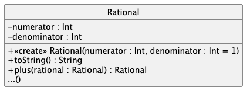

# dev.objets.tp10

_Voir le dernier CM sur la redéfinition des "opérateurs" en Kotlin._

## Préliminaire : une fonction PGCD "Plus Grand Commun Diviseur"

Dans `src/main/kotlin/iut.math/Pgcd.kt` implémentez correctement la 
fonction` pgcd(..)`

Des cas de tests valident votre implémentation.

[voir Calcul du PGCD de deux entiers sur Wikipedia](https://fr.wikipedia.org/wiki/Plus_grand_commun_diviseur_de_nombres_entiers#Calcul_du_PGCD_de_deux_entiers)

## La classe `Rational`

La classe `Rational` que l'on va développer aujourdhui permettra de représenter des "fractions" aussi appelées "nombres rationnels". 

[Voir Nombre rationnel sur wikipedia](https://fr.wikipedia.org/wiki/Nombre_rationnel) 

#### Question 1 : Pour commencer...

Dans `src/main/kotlin/iut.math/Rational.kt`, 
la classe `Rational` devra définir un nombre rationnel 
par deux entiers `numerator` et `denominator`, 
le `denominator` ne pouvant pas valoir `0` (sinon `IllegalArgumentException`). 

On peut également créer un rationnel à partir d'un unique entier ; dans ce cas
son `denominator` vaudra `1`
 
 [Voir Arithmétique des rationnel](https://fr.wikipedia.org/wiki/Nombre_rationnel#Arithm%C3%A9tique_des_rationnels)
    
Implémentez la méthode `toString()` qui renvoie une 
chaîne de caractères représentant le rationnel
    
    Ex : `Rational(2,3) => "2/3"`
    
`TestUmlRational.kt` (puis `TestUsageRational.kt`) vous permet de tester 
une partie de votre code. 

_Vous pouvez également (dé-)commenter une partie des lignes
de `Main.kt` pour tester votre code_

#### Question 2. Opérateur `+` 

1. On souhaite pouvoir utiliser l'opérateur `+` pour réaliser 
la somme de deux rationnels (**sans reduction**). Ex: 

    var r23 = Rational(2,3)
    var r12 = Rational(1,2)
    var result = r23 + r12

Ajoutez le code nécessaire.

2.  On souhaite maintenant pouvoir pouvoir utiliser l'opérateur `+` pour realiser 
la somme d'un rationnel avec un entier (**sans reduction**). Ex :

        var r23 = Rational(2,3)
        var result = r23 + 3

Ajoutez le code nécessaire.

> Des cas de tests sont présents dans `TestSumRational.kt`

> Vous pouvez également compléter le fichier `Main.kt` pour tester votre code

#### Question 3. L'opposé d'un Rationnel et opérateur `-`

1. Implémentez une méthode `opposite() : Rational`
qui retourne l'opposé du rationnel courant [voir wikipedia Opposé](https://fr.wikipedia.org/wiki/Oppos%C3%A9_(math%C3%A9matiques))

   
2. On souhaite pouvoir utiliser l'opérateur `-`
pour réaliser la différence de 2 rationnels. 
**NB :** Utilisez `+` et `opposite()` 

       var r23 = Rational(2,3)
       var r12 = Rational(1,2)
       var result = r23 - r12

> Des cas de tests sont présents dans `TestMinusRational.kt`

#### Question 4. Méthode `reduce()` et opérateurs `==` / `!=`

Implémentez une méthode `reduce() : Rational` qui renvoie 
un rationnel "forme irréductible du rationnel courant" ; 
*le signe est porté par le numérateur si le nombre est négatif ;
si le nombre est positif, pas de signe moins*

**NB :** utilisez la fonction `pgcd(..)`

> Des cas de tests sont présents dans `TestReduceRational.kt`

On souhaite pouvoir utiliser les opérateurs `==` et `!=`
pour vérifier l'égalité/inégalité entre deux rationnels ;
*deux rationnels sont égaux si les numérateurs et dénominateurs
de leurs formes irréductibles sont égaux*

        var r23 = Rational(2,3)
        var r12 = Rational(1,2)
        var r36 = Rational(3,6)
        r23  == r12   // false
        r23 != r12    // true
        r12 == r36    // true

> Des cas des tests sont présents dans `TestEqualsRational.kt`

#### Question 5. Opérateurs de comparaison 

On souhaite utiliser les opérateurs `<`, `>`, `<=` ou `>=`
pour comparer deux rationnels ; 
pour cela il faut *i)* 
ramener les deux rationnels sur le même dénominateur, 
puis **ii)** comparer leurs numérateurs

> Des cas de tests sont présents dans `TestCompareToRational.kt`

#### Question 6. Opérateur "*"

 On souhaite utiliser l'opérateur `*` pour multiplier
deux rationnels. 
 On souhaite également pouvoir multiplier un rationnel par un entier.

> Des cas de tests sont présents dans `TestTimesRational.kt`

#### Question 7. Méthode `ìnverse()` et opérateur `/`

1. Donnez une méthode `inverse() : Rational` qui donne l'inverse
d'un rationnel **si c'est possible** ; sinon lève une exception `ArthmeticException`
    
    https://fr.wikipedia.org/wiki/Inverse

> Des cas de tests sont présents dans `TestInverseRational.kt`

2. On souhaite utiliser l'opérateur `/` pour diviser
    deux rationnels.

Complétez `Main.kt` pour tester votre code

3. On souhaite également pouvoir utiliser l'opérateur `/`  pour 
diviser un rationnel par un entier.

> Des cas de tests sont présents dans `TestDivRational.kt`

#### Question 8. Conversions

1. Donnez deux méthodes `toDouble(): Double` et `toFloat(): Float` qui convertissent un nombre rationnel en `Double`/`Float`.

> Des cas de tests sont donnés dans `TestConvertRational2DoubleOrFloat.kt` 

2. Implémentez la fonction `toRational(x : Double, n : Int) : Rational` présente en dehors
de la classe `Rational`. Aidez-vous de la définition mathématique suivante :

Des cas de tests sont donnés dans `TestConvertDouble2Rational.kt` 

