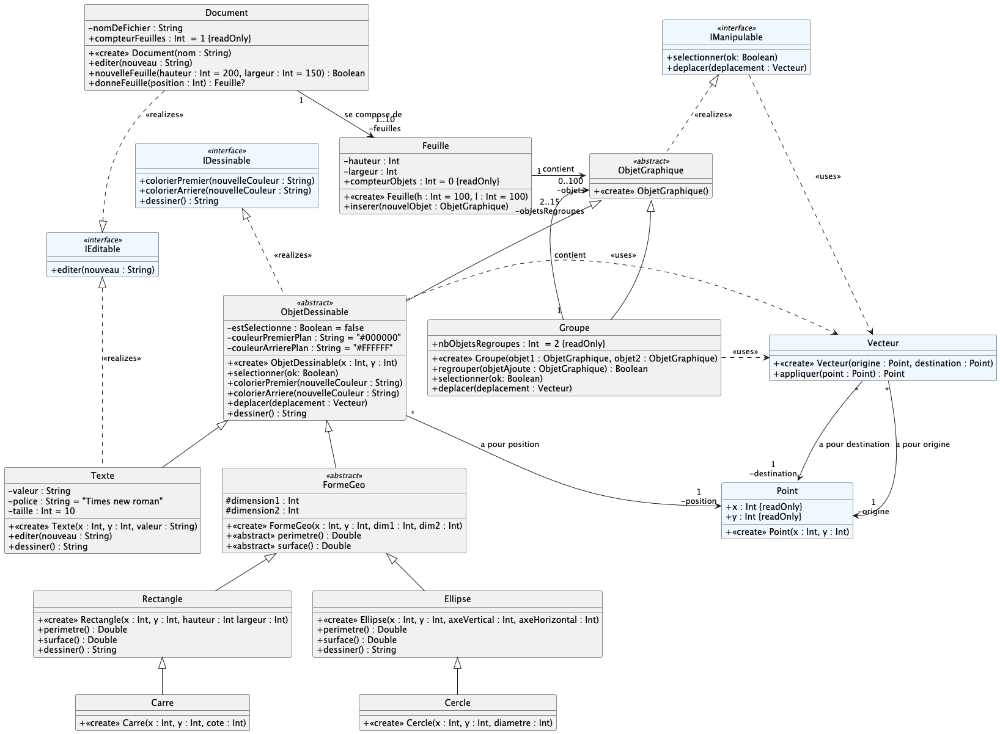
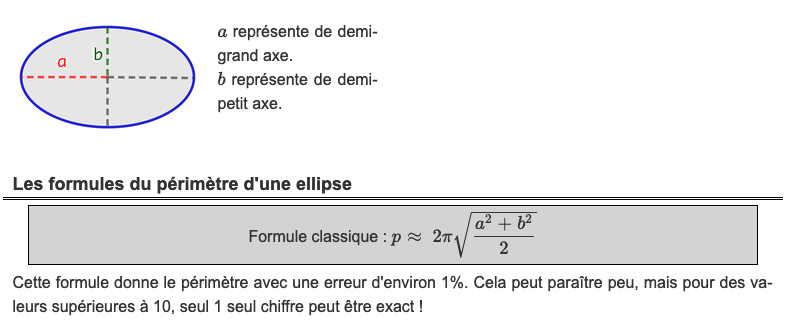

# dev.objets.tp7

_TP à réaliser sous IntelliJ._

Commencez par cloner ce dépôt depuis IntelliJ IDEA
(voir le
tutoriel [IntelliJ IDEA > git](https://gitlab.univ-nantes.fr/iut.info1.dev.objets/2025-2026/dev.objets.tutoriel.intellij.idea/-/blob/main/tuto/git.md))

Implémentez-en Kotlin le diagramme de classe suivant :

Les classes apparaissant en bleu clair vous sont fournies et ne doivent pas être modifiées.
Les classes en gris sont à implémenter.

> Quand on a affaire à un arbre d'héritage comme celui-ci, il faut commencer par implémenter les classes mères.

**Ordre conseillé pour implémenter les classes :**

1. `ObjetGraphique`,
2. `ObjetDessinable`, puis, `FormeGeo`
3. `Rectangle` et `Ellipse`, puis `Carre` et `Cercle`
4. `Texte`
5. `Groupe`
6. `Feuille`
7. `Document`

> Renommez les cas de test `.ktest` -> `.kt` au fur-et-à-mesure.

### Précisions concernant l'implémentation de certaines méthodes

`dessiner() : String` doit donner une chaine de caractères
représentant toutes les caractéristiques de l'objet graphique
considéré, comme suit :

- Pour un `Texte(4,2,"totoro")`, on donnera  `"totoro":X=4,Y=2,P=Times,S=10`
- Pour un `Rectangle(4,2,420,42)`, on donnera `[X=4,Y=2,H=420,L=42]`
- Pour un `Carre(4,2,42)`, on donnera  `[X=4,Y=2,H=42,L=42]`
- Pour une `Ellipse(4,2,420,42)`, on donnera `(X=4,Y=2,AV=420,AH=42)`
- Pour un cercle `Cercle(4,2,42)`, on donnera `(X=4,Y=2,AV=42,AH=42)`

> Attention, il faudra utiliser la surcharge de méthode.

`deplacer(deplacement : Vecteur)` pour n'importe quelle forme géométrique consiste à modifier la position de la forme
géométrique en fonction du vecteur de déplacement.

`deplacer(deplacement : Vecteur)` pour un groupe de figures géométriques consiste à déplacer tous les éléments du
groupe, en appliquant le vecteur de déplacement à chacun d'eux.

`selectionner(ok)` pour un groupe de figures géométriques consiste à sélectionner tous les éléments du groupe, en
appliquant la sélection à chacun d'eux.

`perimetre()`  pour une ellipse se calcule ainsi :

 (depuis [Calculis](https://calculis.net/perimetre/ellipse))

`aire()` pour une ellipse se calcule simplement par `PI * a * b` (où `a` et `b` sont les demi-axes de l'ellipse).

