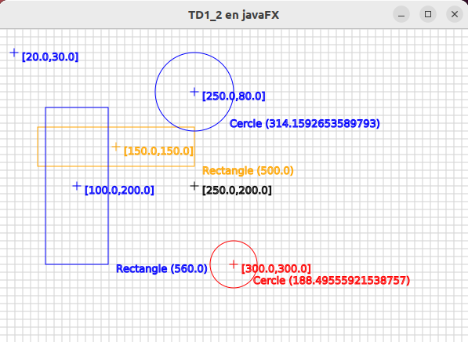
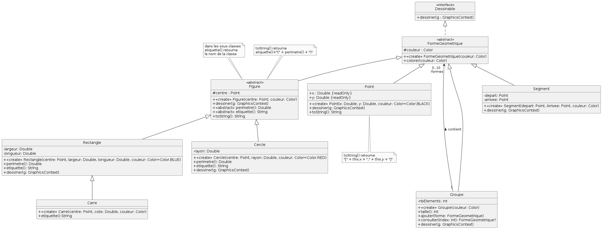

# 
TD1 de développement objet avec IHM 

## Exercice 1

Nous allons étudier comment fonctionne *javaFX*. 
- la classe nommée *TD1_1* présente dans le projet doit hériter de la classe *Application*.
- créer un constructeur qui affiche "je suis dans le constructeur"
-  plusieurs méthodes existent dans la classe [*Application*](https://docs.oracle.com/javase/8/javafx/api/javafx/application/Application.html). Redéfinir les méthodes *init()* et *stop()*. Vous afficherez seulement dans chacune d'elle "je suis dans la méthode *x*". Redéfinir la méthode *start(...)* en regardant les méthodes de *Stage*. L'objet de type *Stage* représente ici la fenêtre qui s'affiche
    - associer un titre à la fenêtre
    - rendre la fenêtre non redimensionnable 
    - la fenêtre doit toujours être au premier plan lorsqu'elle s'affiche
    - créer un objet de type *Scene* qui ne contiendra qu'un seul noeud qui sera un conteneur de type *BorderPane*. La scène aura une dimension de 1000X800 pixels.
   >L'arbre de scène ne comprend donc qu'un élément qui est son noeud racine. Quand on développera des interfaces graphiques plus complexes, les conteneurs ou composants seront insérés comme fils de cette racine dans l'arbre. 
    - associer l'objet de type *Scene* à l'objet de type *Stage* .
    - faire afficher l'objet de type *Stage* (faire afficher aussi une chaîne de caractères avant l'instruction )
- exécuter l'application. Fermer ensuite la fenêtre (cliquer sur la croix en haut à droite de la fenêtre qui s'est ouverte.

>Regarder les affichages du terminal, vous voyez ainsi le cycle de vie d'une application javafx.

## Exercice 2

### 1) Première interface

En vous appuyant sur le cours, vous devez écrire le code kotlin qui permet de reproduire fidèlement l'IHM ci-dessous.
La classe considérée se nomme *TD1_2*.
> L'image liée au bouton est: [`image/fleur.jpg`](image/fleur.jpg)
> Le conteneur à utiliser est de type `VBox`

### 2) Évolution de l'interface

Le but est maintenant d'obtenir le rendu ci-dessous:

> Il faut:
> - mettre en place l'espacement entre composants de 10 pixels
> - un padding entre le conteneur et les composants de 20 pixels à droite et à gauche et 40 pixels en haut et en bas
> - donner une taille au 1er bouton qui est de 200 X 200 pixels
> - mettre en place une marge de 30 pixels de tout côté entre le premier bouton et le conteneur
> - mettre en place une bordure autour du conteneur et du bouton 2. Pour ceci il faut ajouter à ces noeuds des styles CSS javaFX (-fx-border-...).
   si plusieurs styles sont utilisés, il faut les séparer via un ";".
> - lorsqu'on redimensione la fenêtre, il faut que le bouton 2 comme le slider s'étale en largeur dans la fenêtre.

### 3) Test de différents conteneurs

Modifier dans le code développé le type de conteneur qui est lié à la scène.
Etudier et comprendre comment fonctionnent ces nouveaux conteneurs au niveau du placement des composants. Tester le comportement du conteneur lors du redimensionnment de la fenêtre principale.
> Pour certains il faudra supprimer la gestion de l'espace entre élément qui n'est pas possible.

- [HBox](https://devstory.net/10625/javafx-hbox-vbox)
- [FlowPane](https://devstory.net/10627/javafx-flowpane)
- [TilePane](https://devstory.net/10643/javafx-tilepane) 

## Exercice 3: (rédigé en DUT1 par Arnaud Lanoix)

Le but de l’exercice est de dessiner des objets géométriques. Le rendu attendu est celui-ci

### 1) Étudiez les classes dans TD1_3.kt et dans Tableau.kt
   
La classe javaFX nommée `GraphicsContext` est utilisée, regardez sa documentation dans [https://docs.oracle.com/javase/8/javafx/api/javafx/scene/canvas/GraphicsContext.html](https://docs.oracle.com/javase/8/javafx/api/javafx/scene/canvas/GraphicsContext.html)

Regardez surtout les méthodes de cette classe qui vont vous être utiles pour effectuer le développement demandé. La documentation est écrite pour java, mais pas de panique la conversion est assez simple.

Si vous lancez l'application via IntelliJ, le quadrillage s'affiche dans une fenêtre.

### 2) Vous allez maintenant écrire le code pour dessiner les formes géométriques. 
Développer les classes demandées dans le paquetage `ihm.td1.figures`.  Le diagramme de classe vous est fourni à la suite.

- Pour dessiner un point, on dessinera une croix aux coordonnées indiquées
- Pour dessiner un rectangle, on dessinera son centre, et on dessinera le rectangle correspondant.
- Pour dessiner un cercle, on dessinera son centre, et on dessinera le cercle correspondant.
- Pour dessiner un groupe de formes géométriques, on dessinera chacun des éléments du groupe.
Il faudra aussi dessiner de la bonne couleur et également afficher des informations textuelles à côté de chaque forme géométrique.

