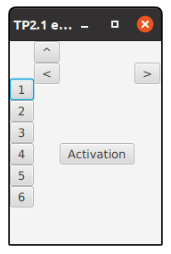
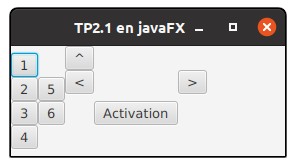

# 
TD2 de développement objet avec IHM 

Le but de ce TD est d'apprendre à réaliser une IHM en utilisant des composants graphiques et des conteneurs.

## I) Détermination des composants graphiques et des conteneurs (réalisé en TD sur feuille)

### 1) Soit l’interface suivante dont deux vues vous sont présentées

- dessinez sur une feuille de papier l’arbre de la scène de cette interface et donnez si besoin les valeurs utilisées pour certaines propriétés de nœuds.

- déterminez les propriétés des nœuds qu’il faut modifier pour parvenir au visuel et au comportement suivant:

- comment obtenir maintenant ce comportement?

## 2) Soit l'interface suivante dont deux vues différentes vous sont présentées

- dessinez sur une feuille de papier l’arbre de la scène de cette interface et donnez si besoin les valeurs utilisées pour certaines propriétés des nœuds.

- déterminez les modifications à apporter pour parvenir au visuel suivant (les propriétés des nœuds à manipuler et leurs valeurs)

# II) Implémentation en javaFX

Vous pouvez utiliser la [documentation Oracle](https://docs.oracle.com/javase/8/javafx/api/toc.htm)

## 1) Développement d'interface 

Ecrire le code des deux interfaces précèdentes.

Pour la seconde interface, il faudra utiliser des propriétés du *TextArea* pour avoir le texte qui se comporte comme sur l'image.

Pour le bouton nommé *Connexion*, il faudra utiliser deux méthodes *static* de la classe *GridPane* pour qu'il se place de manière identique à l'image.

## 2) Utilisation de feuilles de style

Nous allons maintenant utiliser des feuilles de style pour mettre en place le design de la seconde interface plutôt que de modifier directement dans le code la valeur de certaines propriétés.  

- il faut d’abord que vous recopiez dans un autre fichier (*TD2_2Css.kt*) le code contenu dans *TD2_2.kt* (il y a des modifications à réaliser concernant le nom des variables globales).

- il faut ensuite stocker la feuille de style dans le dossier *src/main/ressources*. Vous en disposez d’une dans *ihm.td2.css* qui se nomme *style.css*. Ouvrez là et regardez ce qu’elle contient.

- dans le code *Kotlin* pour y accéder ensuite, il faut associer la feuille de style à la scène:

> *scene.stylesheets.add(TD2_2Css::class.java.getResource("css/style.css").toExternalForm())*

- si on veut appliquer un style sur un nœud, il suffit maintenant de simplement écrire:

> *noeud.styleClass.add("my_style")*
> si *my_style* est une classe définie dans *style.css*

Pour tester:

- commentez la ligne qui correspond à l’application du style *"-fx-border-color: lightgrey"* au *GridPane* qui contient le formulaire. 

- associez à ce nœud la classe contenue dans le fichier *CSS*.

Maintenant le *GridPane* doit être entouré d’une bordure rouge.

## TRAVAIL A FAIRE:

Remplacer les lignes de code où des styles sont écrits en dur par des associations à des classes que vous aurez ajoutées dans le fichier *CSS*.

NB: le design pourrait être complètement réalisé en *CSS* (padding, marge,...)

Vous pouvez utiliser la documentation  [javaFX et CSS](https://docs.oracle.com/javase/8/javafx/api/javafx/scene/doc-files/cssref.html)
et un [tutoriel](https://docs.oracle.com/javafx/2/css_tutorial/jfxpub-css_tutorial.htm)

## 3) une autre interface à développer

Vous commencerez par déterminer à l’écrit les différents composants graphiques et conteneurs utilisés et ensuite vous développerez l’interface en javaFX. 

Un nouveau type de conteneur est utilisé ici : TitledPane.  Il est constitué  d’une zone avec un titre (par exemple : Consultation des livres) et on peut aussi lui associer un conteneur qui se placera en dessous du titre (dans l’exemple précédent : un conteneur qui contient les deux boutons pour se déplacer dans la liste de livres et la zone d’affichage.

