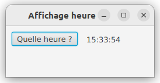
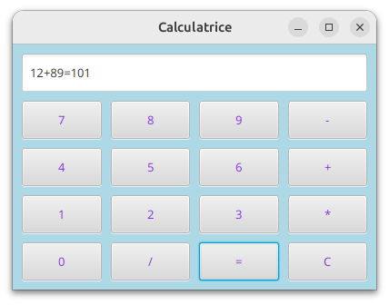
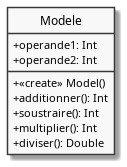
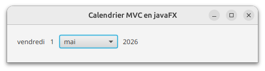

# TD4: premiers exercices MVC

## I) Exercice 1

Nous allons développer une application *MVC* simple qui permet lorsqu'on clique sur un bouton d'afficher l'heure.
Le répertoire de travail est *heureMVC*

<p align="center">

</p>


### 1) Développement de la vue 

Dans le répertoire *vue* => classe *Vue*
> un bouton et un label, le label sera vide


### 2) Développement du contrôleur principal

Compléter le code de la classe *Heure* qui peut être considérée comme le contrôleur principal de l'application pour simplement afficher la vue.

> la classe *Model* est fourni dans le répertoire *modele*


### 3) Développement du contrôleur *ControleurBoutonHeure* 

- dans le répertoire *controleur*, développer la classe *ControleurBoutonHeure* qui gére le clic sur le bouton

- développer la méthode *fixeControleurBoutonHeure(...)* dans la classe *Vue* qui permet d'associer au bouton un contrôleur

### 4) Mise à jour de la classe *Heure*

Mettre à jour la classe *Heure* pour gérer maintenant le clic sur le bouton.

## II) Exercice 2

Nous allons développer une calculatrice en suivant l'architecture MVC (Modéle - Vue - Contrôleur).
Cette calculatrice ne permet que de réaliser les opérations **binaires** *+*, *-*, * , */*.
Le répertoire de travail est *calculatriceMVC*

La vue vous est fournie dans le répertoire *vue* => classe *Vue*
<p align="center">

</p>


### 1) Affichage de la vue sans interaction avec l'utilisateur

- compléter le code de la classe *Calculatrice* qui peut être considérée comme le contrôleur principal de l'application pour simplement afficher la vue.


### 2) Développement du modèle de l'application

- implémenter le classe UML ci-dessous dans le répertoire *modele*
<p align="center">

</p>

- créer une instance du modèle dans le contrôleur principal

### 3) Mise en place de la fonctionnalité "saisie d'une expression mathématique => opérande opérateur opérande"  

a) développer le contrôleur *ControleurBoutonChiffreOperateur* qui permet lorsqu'un bouton représentant un **chiffre** ou un **opérateur (+,-,*,/)** est cliqué alors le "text" du bouton s'affiche à la suite dans le TextField.
>>Si *"567"* est déjà saisi alors si on appuie sur le bouton "+", la chaîne *"567+"* s'affiche dans le *TextField*

b) maintenant nous allons rendre l'expression mathématique constituée valide pour notre cas d'étude. 
>>Il faut qu'au fur et à mesure de la constitution de l'expression, la syntaxe reste valide. *"456"*, *"34+"*, *"67-56"*) sont par exemple des expressions valides. 

Pour cela vous disposez dans le paquetage *tools* de la classe *Expression* et de la méthode *isValidExpression()* développée à l'aide d'expressions régulières. Il suffit que lorsqu'un bouton représentant un chiffre ou un opérateur est cliqué, l'expression résultante soit testée.
- si l'expression est correcte, la valeur cliquée est concaténée à ce qui existe déjà dans le *TextField*
- si elle est incorrecte, il faudra afficher un message d'erreur dans le terminal et réinitialiser le *TextField*
à "".

c) dans le contrôleur principal, faire l'association entre le contrôleur *ControleurBoutonChiffreOperateur* et les boutons concernés.

d) tester

### 4) Appui sur la touche "="


- il faut vérifier la validité de l'expression (exemple d'expression valide: 125+13).
- il faut découper la chaine dans le *TextField* pour récupérer les opérandes et l'opérateur 
inspirez vous de ce code:


 ```kotlin
 val expression="154+26"
// on récupère dans la chaine les opérateurs
 // match.value.first() contient l'opérateur (il n'y en a qu'un dans notre cas)
  val match = Regex("[+\\-*/]").find(expression)

// on découpe l'expression suivant les 4 opérateurs
// dans l'exemple, *parties* est un tableau qui contient 2 nombres, 154 et 26
  val parties = expression.split(Regex("[+\\-*/]"))
   ```


- il faut maintenant calculer le résultat de l'opération et l'afficher. Le résultat est calculé (bien sûr dans le modèle) et s'affiche comme suit: "12+13=25"
  (mettre à jour le modèle et réaliser l'affichage dans le *textField*)


### 5) Appui sur la touche "C"

L'appui sur cette touche permet de remettre la vue dans son état initial.

### 6) Gestion des erreurs

Maintenant que vous avez une calculatrice fonctionnelle, gérer les différentes erreurs qui peuvent encore se produire lors de l'appui sur les différents boutons.

Tout ceci se passe dans les contrôleurs.


## III) EXERCICE 3

Le but de cet exercice est de développer une application de type calendrier qui sera initialisée au départ à la date du jour
=> répertoire *calendrierMVC*

Lorsqu'un utilisateur choisira un mois dans la comboBox, la date sera modifiée.

Lorsque l'utilisateur appuiera sur la touche *LEFT* de son clavier, le calendrier reculera d'un jour et sur la touche *RIGHT* le calendrier avancera d'un jour.

<p align="center">

</p>

### 1) le modèle (classe *Calendrier* dans modele)

Regardez la classe *Calendrier* fournie qui sera utilisée. Elle encapsule
la classe *Calendar*  qui est une classe *java* qui représente un calendrier.

Les méthodes de la classe Calendrier permettent par exemple:

    - de récupérer des informations concernant la date actuelle du calendrier (le numéro du jour dans le mois, le numéro du mois ...)
    - d'ajouter un mois ou un jour à la date actuelle du calendrier
    

Pour information les méthodes de cette classe utilisent celles de la classe *Calendar* dont vous avez quelques exemples d'utilisation dans le tableau ci-dessous 


| Utilisation méthode get    | Résultat                                    |
|----------------------------|---------------------------------------------|
| get(Calendar.DAY_OF_WEEK)  | 1 (Calendar.SUNDAY) à 7 (Calendar.SATURDAY) |
| get(Calendar.YEAR)         | année                                       |
| get(Calendar.MONTH)        | 0 (Calendar.JANUARY) à 11 (Calendar.DECEMBER) |
| get(Calendar.DAY_OF_MONTH) | 1 à 31                                      |
| get(Calendar.DATE)         | 1 to 31                                     |


Vous n'aurez pas à manipuler directement la classe *Calendar* mais *Calendrier*.

### 2) développement de la méthode *update()* dans la vue

Cette méthode permet la mise à jour de la vue lors d'une modification de date.

### 3) affichage de la vue

Il faudra, au lancement de l’application, que le calendrier affiche la date du jour.
> ajout dans Main.kt


### 4) Modification de la date via un appui de touche

Lorsqu’on appuie sur les touches *LEFT* ou *RIGHT* du clavier la date avance ou recule d’un jour. Il faut bien sûr que soit géré le changement de jour, de mois et d’année.

> - modification à réaliser dans ControleurTouche
> - développement d'une méthode dans la vue pour associer le contrôleur à la vue
> - association du contrôleur à la vue dans Main

### 4) Modification du mois dans la comboBox

Quand on sélectionne un mois dans la *comboBox* alors le jour s’adapte. Dans l’exemple de la capture d’écran vue plus haut, si on sélectionne *juin*, le jour devient *lundi*.  

> - modification à réaliser dans ControleurComboBox
> - développement d'une méthode dans la vue pour associer le contrôleur à la vue
> - association du contrôleur à la vue dans Main
