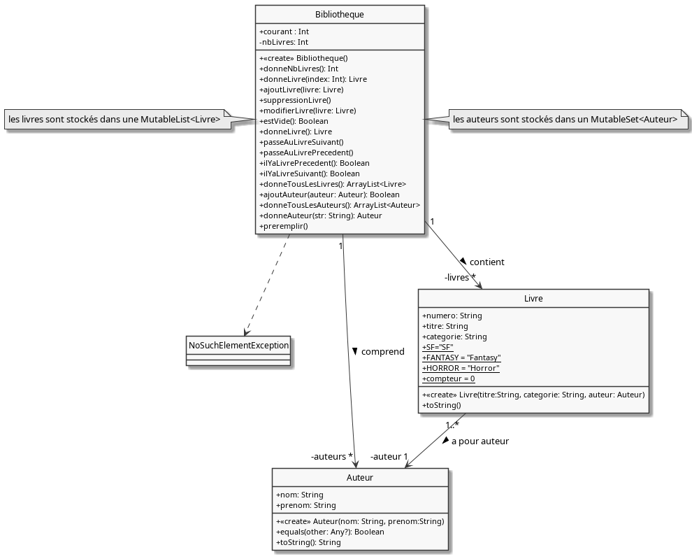
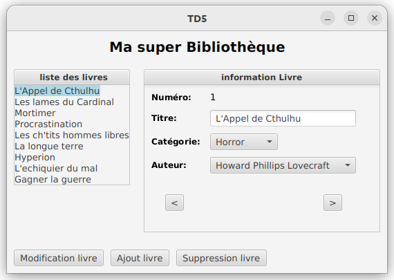
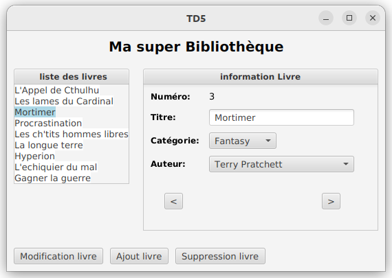

# 
 Développement d'un gestionnaire de BD en MVC (première partie) 

Nous allons mettre en place une architecture MVC (Modèle-Vue-Contrôleur) dans le cadre du développement d’une IHM pour la gestion simplifiée d’une bibliothèque de BD (Bandes Dessinées). 
Rappelez vous le principe. L’utilisateur interagit via la vue avec l’application. Lorsque des événements sont déclenchés, ce sont les contrôleurs qui font le lien dans les 2 sens entre le modèle et la vue et ils peuvent aussi réaliser des traitements. 
La vue et le modèle ne se connaissent pas.

## 1) Etude des classes liées au modèle

Vous avez ci-dessous le diagramme de classe relatif à la Bibliothèque. Vous commencerez par l'étudier pour comprendre comment fonctionne le modèle.
Vous avez aussi sur ce diagramme les classes *Auteur* et *Livre* qui sont dans le répertoire *librairie* du projet et qui sont des classes "outil" qui seront utilisées indifféremment par toutes les couches de l’architecture MVC.
Le code de ces classes vous est fourni.

## 2) Etude de la vue

Etudiez la vue principale de l’application pour comprendre comment elle est implémentée => classe *MainVue* et classe *TitledPaneLivre*.
Le conteneur de type *TitledPane* de javaFX est utilisé.

## 3) Affichage de la vue

La classe *Main* qui vous est fournie (on peut considérer cette classe comme le contrôleur principal), permettra de lancer votre application javaFX.
Vous allez, dans la méthode start(…):
- instancier une *MainVue* et un modèle *Bibliotheque*
- insérer des données dans la bibliotheque (méthode preremplir())
- mettre à jour le contenu du panneau droit et du panneau gauche de la vue (des méthodes sont disponibles dans la vue). 

Pour l’instant, nous ne nous préoccuperons pas des autres contrôleurs. Vous devez avoir le même rendu que dans la capture d’écran ci-dessous.

## 4) Mise en place du contrôleur *ControleurDetailLivre*

Il permet lors d’un clic souris sur un élément de la liste de gauche, d’afficher dans le panneau droit le détail du livre sélectionné. 
Lors d’un clic sur un élément, celui qui était déjà sélectionné se désélectionne (méthode dans  *MainVue*)
- les éléments dans le panneau de gauche (*GridPane*) sont des *Label*. 
- vous pouvez récupérer l‘élément cliqué via la propriété source de l’événement
- vous pouvez récupérer le numéro de ligne de l’élément cliqué dans la grille via la méthode de classe de *GridPane*
  => *getRowIndex(Node)*.
  Vous avez accès dans les contrôleurs aux classes du modèle et de la vue.
  N’oubliez pas de mettre aussi à jour le contenu du panneau droit.

Une fois le contrôleur développé, Il faut maintenant que vous abonniez les éléments de votre liste gauche à ce contrôleur. 
Ceci se passe dans la classe *Main*. Une méthode existe dans *MainVue* pour le réaliser.

## 5) Mise en place des contrôleurs *ControleurLivrePrecedent* et *ControleurLivreSuivant*

### a) gestion des boutons *précédent* et *suivant* dans le panneau de droite
- lors du clic sur le bouton *<*, les détails du livre précédent dans la bibliothèque s’affichent dans le panneau de droite.
- lors du clic sur le bouton *>* les détails du livre suivant dans la bibliothèque s’affichent dans le panneau de droite.

> Attention de ne pas déclencher d’exceptions lorsque la fin et le début de liste sont atteints.

> N’oubliez pas d’abonner les deux boutons précédents à leur contrôleur respectif (méthode dans *MainVue*).
Ceci est à réaliser dans le contrôleur principal.

### b) désactivation des boutons *précédent* et *suivant*
Lorsque la fin de liste est atteinte, c’est à dire qu’il n’y a plus de livre suivant, le bouton *>*  doit être désactivé.
Réaliser la même chose pour le bouton *<* quand le début de liste est atteint et qu’il n’y a plus par conséquent de livre précédent.

### c) synchronisation des panneaux gauche et droit
Le panneau gauche et le panneau droit doivent être synchronisés. 
- lorsque les livres défilent dans le panneau de droite à l’aide des deux boutons, le même élément doit être sélectionné dans la grille de gauche (couleur bleu clair). 
- si un élément est sélectionné à gauche avec la souris, si c’est le premier de la liste alors le bouton *<* est désactivé. 
- si c’est le dernier de la liste alors le bouton *>* est désactivé