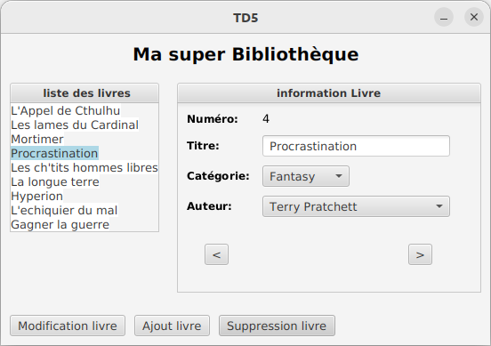
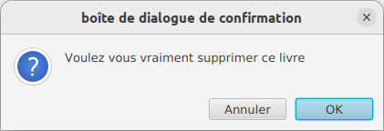
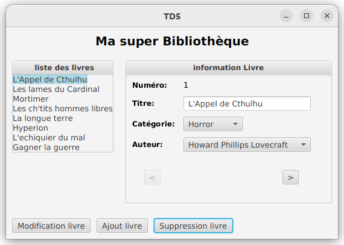
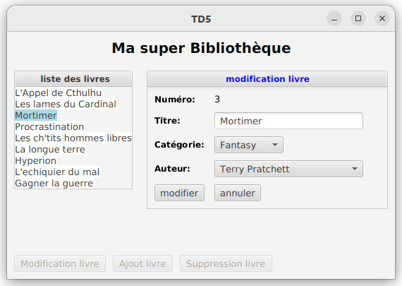
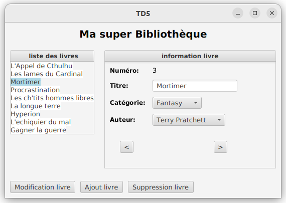
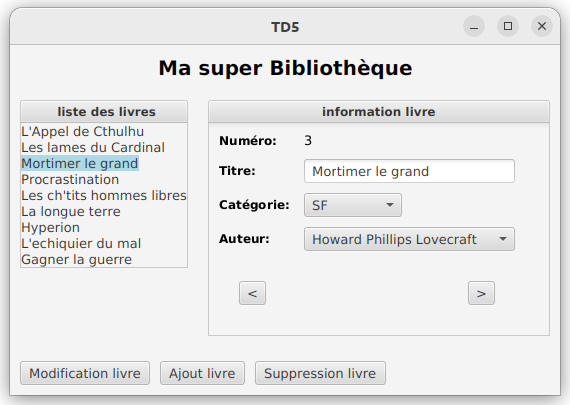
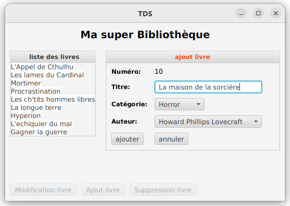
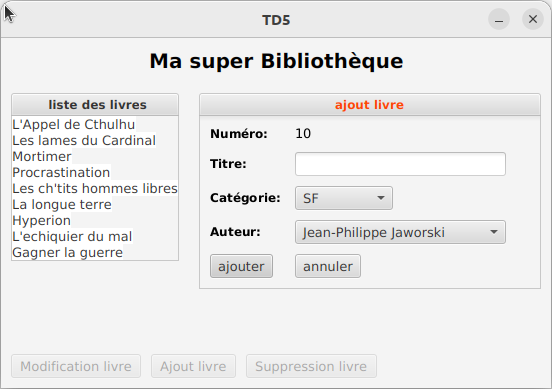
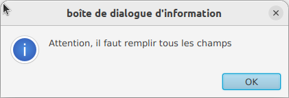
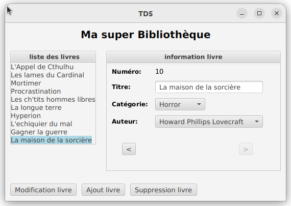

# 
 Développement d'un gestionnaire de BD en MVC (seconde partie) 

Nous allons maintenant mettre en place les fonctionnalités de suppression de livre, de modification de livre et d'ajout de livre.

## I) Suppression d'un livre

Lorsque l’utilisateur sélectionne le bouton *Suppression livre* pour supprimer le livre courant, alors une fenêtre de dialogue modale (de type confirmation) s’affiche pour qu’il confirme ou non son choix. 

    

- s’il confirme (bouton *OK*), le livre est effectivement supprimé du modèle et du panneau de gauche.
  Le premier livre de la liste est sélectionné et ce sont les informations qui lui sont liées qui sont affichées dans le panneau de droite.
> Attention de gérer le cas limite quand il n'y a plus de livre dans la bibliothèque après suppression.

- sinon (bouton *Annuler*),  on revient à l'état initial (avant la demande de suppression du livre)
  

### Travail à réaliser

Il faut développer le contrôleur *ControleurBoutonSuppressionLivre* qui permet l'ouverture de la boîte de dialogue et la gestion de la suppression comme décrit précédemment

## II) Modification d'un livre

### 1) Liste des fonctionnalités à développer
Ci-dessous est explicité le comportement attendu pour cette fonctionnalité. En partie 2, vous êtes guidés pour réaliser cette fonctionnalité.

#### a) Clic sur le bouton *Modification livre* 

Lorsque l’utilisateur clique sur le bouton *Modification livre* alors:
- une nouvelle vue s'affiche dans le panneau de droite qui permet de modifier le livre courant sélectionné dans le panneau gauche
- le *TextField* devient éditable
- les deux *ComboBox* permettent de choisir une des trois catégories (SF, Fantasy, ..) et un auteur parmi ceux déjà présents dans le modèle
- les boutons *Modification livre*, *Ajout livre* et *Suppression livre* de la vue principale sont désactivés

#### b) Clic sur les boutons *annuler* et *modifier* dans le panneau droit

- lorsque l’utilisateur clique sur le bouton *annuler*, la vue de départ est de nouveau affichée (ici *Mortimer* sélectionné dans la liste de gauche et les détails du livre *Mortimer* dans le panneau de droite). 
Les trois boutons en bas de la vue principale sont réactivés.

- lorsque l’utilisateur clique sur le bouton *modifier* alors le livre sélectionné à gauche est modifié si le *textfield* n'est pas vide (s'il est vide une fenêtre s'affiche qui demande à l'utilisateur de  saisir un texte)

Les informations concernant ce livre sont affichées dans le panneau de droite. 
Les trois boutons en bas de la vue principale sont réactivés. 
Attention, si le champ texte devient vide, une fenêtre de dialogue avertit l'utilisateur et la modification n'a pas lieu.

Il faut aussi bien sûr que tout fonctionne comme au départ (boutons *<*, *>*, ...)

### 2) Réalisation

#### a) Le panneau de droite qui affiche la vue pour la modification

Développer au niveau de la vue, la classe *TitledPaneLivreModification* qui est une sous-classe de *TitledPaneLivre*. 
Il faudra redéfinir la méthode *update(…)* qui permet la mise à jour de la vue (le *TextField* sera éditable et le titre du *TitledPane* sera en bleu) et la méthode *setBoutons(…)* pour placer les deux boutons *modifier* et *annuler* dans la vue.

#### b) Le contrôleur ControleurBoutonModificationLivre

Ce contrôleur sera associé au bouton *Modification livre*.
Il permettra:
- d’afficher dans le panneau de droite la vue "modification" (*TitledPaneLivreModification*) qui sera relative au livre sélectionné dans le panneau de gauche
- à partir du modèle, d’assigner à la *ComboBox* liée aux auteurs, les auteurs présents dans le modèle
- de sélectionner dans les deux *ComboBox* respectivement la catégorie et l’auteur du livre courant
- de désactiver les trois boutons du bas de la vue principale
- d’abonner les boutons *modifier* et *annuler* à leur contrôleur respectif
  => *ControleurModifierPanneauDroit* et *ControleurAnnulerPanneauDroit*

#### c) Le contrôleur ControleurAnnulerPanneauDroit

Il permettra:
- d’afficher la vue (*TitledPaneLivre*) dans le panneau de droite qui correspond au livre sélectionné dans le panneau de gauche
- d’abonner les deux boutons *<* et *>* à chacun de leur contrôleur
- de réactiver les trois boutons du bas de la vue principale.

#### d) Le contrôleur ControleurModifierPanneauDroit

Il permettra:
- de récupérer via la vue, les informations saisies éventuellement dans le *TextField* et celles sélectionnées dans les deux *ComboBox*. Si le *TextField* est vide, une fenêtre de dialogue de type ALERT le mentionnera et aucune modification ne sera effectuée.
- de réaliser la modification des informations du livre dans le modèle
- de réaliser la mise à jour de l’affichage dans le panneau de gauche et la mise en place du panneau de droite (TitledPaneLivre) qui affichera les informations du livre modifié
- d’abonner les deux boutons *<* et *>* à leur contrôleur respectif
- de réactiver les trois boutons du bas de la vue principale

**Assurez vous que tout fonctionne correctement avant de passer à la suite**

## III) Ajout d’un livre

### 1) Fonctionnalités à développer

#### a) clic sur le bouton *ajout livre* de la vue principale

Vous avez ci-dessous une capture d’écran après un clic de l'utilisateur sur le bouton *ajout livre*.

Vous remarquerez que:
- le titre du panneau de droite devient " ajout livre" et est en rouge (*TitledPaneLivreAjout*)
- le numéro du livre à ajouter correspond à son futur numéro dans la liste
- le *TextField* est éditable
- plus aucun livre n’est sélectionné dans la liste de gauche
- on peut choisir via les ComboBox la catégorie du livre et le nom de l’auteur
- les trois boutons du bas de la vue principale sont désactivés.

#### b) clic sur le bouton *ajouter* du panneau droit

Si le *TextField* du panneau droit qui permet d’ajouter un livre n’est pas rempli au moment où le bouton *ajouter* est cliqué alors une fenêtre de dialogue modale (de type information) s’affiche pour notifier ce fait à l’utilisateur. 
Lors de sa fermeture par l’utilisateur, le panneau de droite reste identique à ce qu'il était avant l’appui sur le bouton *ajouter*.

 

Dans la 3ème capture (après l’ajout), on voit que:
- le livre ajouté est présent à la fin de la liste dans le panneau de gauche et est sélectionné
- le panneau de droite affiche les informations relatives à ce nouveau livre
- le bouton suivant est désactivé
- les trois boutons en bas de la vue principale sont réactivés.

### 2) Développement de la vue et des contrôleurs

Maintenant que vous avez compris comment réaliser la modification à la question II, vous allez mettre en place l’ajout de livre.
Le contrôleur du bouton *Ajout livre* se nomme *ControleurBoutonAjoutLivre*. Celui du bouton *ajouter* du panneau droit se nomme *ControleurAjouterPanneauDroit*. 
Vous n’avez pas besoin de réaliser celui concernant le bouton *annuler*, il a déjà été développé dans la partie précédente.

- développer la classe *TitledPaneLivreAjout* dans le répertoire vue qui correspond au panneau qui sera affiché à droite lors de l’ajout de livre.
- développer les deux contrôleurs *ControleurBoutonAjoutLivre* et *ControleurAjouterPanneauDroit*.

Assurez vous qu’après l’ajout du livre, ce livre soit sélectionné dans le panneau de gauche et ses informations soient affichées dans le panneau de droite. 
Vérifiez que les boutons "<" et ">" fonctionnent correctement.

**Bravo !! Vous avez réalisé votre première application de type CRUD (Create, Read, Update, Delete) en respectant l'architecture MVC**

## IV) Pour aller plus loin

### 1) Ajout de l'image des livres
- Les livres maintenant ont chacun une image représentant leur couverture qui leur est associée (récupérer des images sur internet que vous stockerez en local dans le projet). Dans le panneau de droite qui affiche les informations, afficher maintenant aussi cette image.
  Vous effectuerez bien sûr aussi des modifications dans le modèle pour ajouter les liens vers ces images.

### 2) Modification de la fonctionnalité *ajout de livre* 
Vous allez maintenant permettre l'ajout d'un livre dont l'auteur n'est pas déjà présent dans la bibliothèque. Ne pas oublier que maintenant les livres ont aussi une image qui leur est associée.
- on pourra saisir le nom et le prénom du nouvel auteur (attention si les 2 champs sont vides ou si l'auteur existe déjà l'ajout n'est pas réalisé)
- on pourra renseigner pour ce nouveau livre, l'adresse locale de l'image qui aura été téléchargée en amont.  Vous utiliserez le composant *FileChooser* (voir exemple dans le cours)

